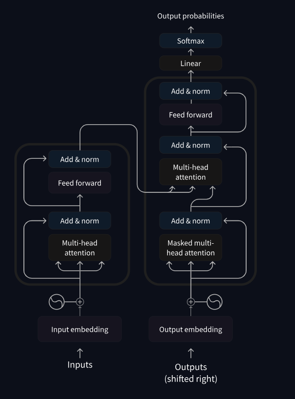

## HuggingFace Tutorial

### Module 1 - Transformer Models

- [Pipeline Function](#pipeline-punction)
- [Transformers](#transformers)
- [Encoder Models](#encoder-models)
- [Decoder Models](#decoder-models)
- [Sequence to Sequence Models](#sequence-to-sequence-models)
- [Biases and Limitations](#biases-and-limitations)

### Pipeline Function

- Connects model with its necessary preprocessing and postprocessing steps

```
from transformers import pipeline

classifier = pipeline("sentiment-analysis")
classifier("I've been waiting for a HuggingFace course my whole life.")
```

Returns: `[{'label': 'POSITIVE', 'score': 0.9598047137260437}]`

- Pipeline default selects a particular pretrained model that's fine-tuned for English sentiment analysis.
- Model is downloaded and cached when you create the **classifier** object

Can choose the following pipelines:
- `feature-extraction`
- `fill-mask`
- `NER` (named entity recognition)
- `question-answering`
- `sentiment-analysis`
- `summarization`
- `text-generation`
- `translation`
- `zero-shot-classifiation`

Three main steps involved in passing text to a pipeline:
1. Text is preprocessed into a format the model can understand
2. The preprocessed inputs are passed to the model
3. The predictions of the model are post-processed so they make human readable sense

**Zero Shot Classificaiton**
- Allows you to speciy which labels to use for the classification (don't have to rely on pretrained model)
- Called zero-shot as you don't need to fine-tune the model on your data to use it

```
classifier = pipeline("zero-shot-classification")
classifier(
    "This is a course about the Transformers library",
    candidate_labels=["education", "politics", "business"],
)
```

Returns: 
```
{
    'sequence': 'This is a course about the Transformers library',
    'labels': ['education', 'business', 'politics'],
    'scores': [0.8445963859558105, 0.111976258456707, 0.043427448719739914]
}
```

**Text Generation**
 - Provide prompt and model will auto-complete it by generating the remaining text
 - Kinda like predictive text feature

```
from transformers import pipeline

generator = pipeline("text-generation")
generator("In this course, we will teach you how to")
```

Returns:
```
[{'generated_text': 'In this course, we will teach you how to understand and use '
                    'data flow and data interchange when handling user data. We '
                    'will be working with one or more of the most commonly used '
                    'data flows — data flows of various types, as seen by the '
                    'HTTP'}]
```

- Can control how many different sequences are generated (`num-return-sequences`)
- Can also control total output length (`max-length`)


**Specific Models**
- Can also identify specific models from the model hub using this [link](https://huggingface.co/models)

Ex: `generator = pipeline("text-generation", model="distilgpt2")`


**Mask Filling**
- Fill in the blanks of a given text
- I think this is what BERT was trained to do originally (as well as next sentence prediction)

```
from transformers import pipeline

unmasker = pipeline("fill-mask")
unmasker("This course will teach you all about <mask> models.", top_k=2)
```

Returns:
```
[
    {   
        'sequence': 'This course will teach you all about mathematical models.',
        'score': 0.19619831442832947,
        'token': 30412,
        'token_str': ' mathematical'
    },
    {
        'sequence': 'This course will teach you all about computational models.',
        'score': 0.04052725434303284,
        'token': 38163,
        'token_str': ' computational'
    }
]
```

- `top_k` = How many possibilities we want to display
- `<mask>` = Special mask token


**Named Entity Recognition (NER)**
- Model has to find which parts of the input text correspond to entities like persons, locations, or organizations

```
from transformers import pipeline

ner = pipeline("ner", grouped_entities=True)
ner("My name is Sylvain and I work at Hugging Face in Brooklyn.")
```

Returns:
```
[
    {'entity_group': 'PER', 'score': 0.99816, 'word': 'Sylvain', 'start': 11, 'end': 18}, 
    {'entity_group': 'ORG', 'score': 0.97960, 'word': 'Hugging Face', 'start': 33, 'end': 45}, 
    {'entity_group': 'LOC', 'score': 0.99321, 'word': 'Brooklyn', 'start': 49, 'end': 57}
]
```

- `grouped_entities = True` tells pipeline to regroup together the parts of the sentence that correspond to the same entity
    - ex. "Hugging" and "Face" gets grouped to "Hugging Face"

**Question Answering**
- Answers questions using information from a given context

```
from transformers import pipeline

question_answerer = pipeline("question-answering")
question_answerer(
    question="Where do I work?",
    context="My name is Sylvain and I work at Hugging Face in Brooklyn",
)
```

Returns: `{'score': 0.6385916471481323, 'start': 33, 'end': 45, 'answer': 'Hugging Face'}`

**Summarization**
- Reduce a text into a shorter text while keeping all (or most) important aspects referenced in the text
- Can specify a `max_length` or a `min_length` for the result
- Not gonna give an example, this one is intuitive.

**Translation**
- Can use a default model if you provide a language par in the task name (like `translation_en_to_fr`)
- Can also specify a `max_length` or a `min_length`


### Transformers

Transformer model groups (broadly):
1. GPT-like (auto-regressive transformers)
2. BERT-like (auto-encoding transformers)
3. BART/T5 -like (sequence-to-sequence transformers)

- All transformers are language models
    - Have been trained on large amounts of raw text in a self-supervised fasion
    - Training in which the objective is automatically computed from the inputs of the model
    - Humans are not needed to label the data

- These models develop statistial understanding of the language it has been trained on but they're not very useful for specific practical tasks
- General model goes thorugh a process called **transfer learning** where it's fine-tuned in a supervised way
    - Sharing trained weights and building on top of already trained weights reduces the overall compute cost and carbon footprint

- General strategy to achieve better performance is by increasing the models' sizes as well as the amount of data they're pretrained on
- Training a large model though requires a lot of data and becomes very expensive

**Pre-training** = Training a model from scratch
- weights randomly initialized
- training starts without any prior knowledge

**Fine-tuning** = Training a pre-trained model on a more specific dataset according to your task 
- Pre-trained model was already trained on a dataset that has some similarities with the fine-tuning dataset
- Fine tuning requires a lot less data to get decent results

**Transformer Architecture**
- Encoder (left) - Recieves an input and builds a representation of it (its features). Model is optimized to aquire understanding from the input.
- Decoder (right) - Uses the encoder's representation (features) along with other inputs to generate a target sequence. Model is optimized for generating outputs.

- Encoder-only models = Good for tasks that require understanding of the input like sentence classification and NER
- Decoder-only models = Good for generative tasks like text generation
- Encoder-decoder models or seq2seq models = Good for generative tasks that require an input like translation or summarization

- Models built with special layers called attention layers
    - Tells the model to pay specific attention to certain words in the sentence you passed it
    - More or less ignore the others when dealing with the representation of each word
    - A word by itself has meaning but that meaning is deeply affected by the context

- Original architecture
    - Designed for translation
    - During training, encoder recieves inputs in one language while decoder recieves the same inputs in the other language
        - In the encoder, the attention layers can use all the words in a sentence
        - The Decoder works sequentially and can only pay attention to the words in the sentence that it has already translated
        - For example, when we have predicted the first three words of the translated target, we give them to the decoder which then uses all the inputs of the encoder to try to predict the fourth word.
    - To speed things up during training (when the model has access to target sentences), the decoder is fed the whole target, but it is not allowed to use future words




    - First attention layer in a block pays attention to all (past) inputs to the decoder. 
    - The second attention layer in the decoder uses the output of the encoder.
    - Thus it can access the whole input sentence to best predict the current word.

    - Can use attention masks to prevent model from paying attention to some special words (like `<padding>`)

- Architecture = Skeleton of model - definition of each operation that happens within the model
- Checkpoints = Weights that will be loaded in a given architecture
- Model = Umbrella term that can mean both "architecture" or "checkpoint"


### Encoder Models
- Use only the encoder of the transformer
- At each stage the attention layers can access all the words in the initial sentence
- Models are characterized as having "bi-directional" attention and are often called **auto-encoding models**

- Pretraining usually revolves around somehow corrupting a given sentence (like masking) and tasking the model with finding or reconstructing the initial sentence.
- Best suited for tasks requiring an understanding of the full sentence like classification, NER, or extractive QA

- Popular models include: ALBERT, BERT, DistilBERT, ELECTRA, RoBERTa


### Decoder Models
- Only use the decoder of a transformer
- At each stage, the attention layers can only access the words positioned before it in the sentence
- Models often called auto-regressive models

- Pretraining usually revoles around predicting the next word in the sentence
- Best suited for tasks involving text generation

- Popular models include: CTRL, GPT, GPT-2, Transformer XL


### Sequence To Sequence Models
- Use both parts (encoder and decoder) of the transformer architecture
- At each stage attention layers of the encoder can access all the words in the initial sentence
- Attention layers of the decoder can access only the words positioned before a given word in the input.

- Pre-training can be done using the objectives of encoder or decoder models but usually involves something a bit more complex.
    - Ex, T5 is pretrained by replacing random spans of text with a single masked word and the objective is to predict the text that this masked word replaces
- Best suited for tasks revolving around generating new sentences depending on a given input like summarization, translation, or generative QA.

- Popular models include: BART, mBART, Marian, T5

### Biases and Limitations
- To enable pretraining on large amounts of data, researchers often scrape all the content they can find
    - Takes the best and the worst from the internet

Example:
```
from transformers import pipeline

unmasker = pipeline("fill-mask", model="bert-base-uncased")
result = unmasker("This man works as a [MASK].")
print([r["token_str"] for r in result])

result = unmasker("This woman works as a [MASK].")
print([r["token_str"] for r in result])
```

Returns:
```
['lawyer', 'carpenter', 'doctor', 'waiter', 'mechanic']
['nurse', 'waitress', 'teacher', 'maid', 'prostitute']
```

- A bit problematic. 
- Therefore need to keep in mind that the original model could very easily generate sexist, racist, or homophobic content.
- Fine tuning the model on your data won't make this intrinsic bias disappear
