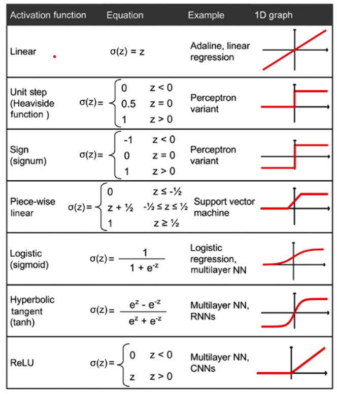

## Textbook Chapter 12 Notes

- [Building a NN model in PyTorch](#building-a-nn-model-in-pytorch)

## Questions
- Tensor vs NumPy array
- I think the different activation functions is cool (sigmoid can get trapped in the local minima and using tanh as activation in hidden layers)

## Notes
- Python is limited to execution on one core due to the global interpreter lock (GIL)
- GPUs can be used to optimize weight parameters quickly
    - Challenge is writing code to target GPUs is not simple

- PyTorch = scalable and multiplatform programming interface for implementing and running ML alrogithms including wrappers for DL
- Primarily developed by the researchers and engineers from Facebook AI Research
- ALlows execution on CPUs, GPUs, and other devices like TPUs

- PyTorch is built around a computation graph composed of a set of nodes
    - Each node represents an operation that have 0+ inputs
    - Evaluates operations, executes computation, and returns concrete values immediately
    - Computation graph in PyTorch is defined implicitly rather than constructed in advance and executed after

- Tensors can be understood as a generalization of scalars, vectors, matrices, and so on.
    - Scalar = rank-0 tensor
    - Vector = rank-1 tensor
    - Matrix = rank-2 tensor
    - Stacked Matrices = rank-3 tensor

    - Similar to NumPy arrays except tensors are optimized for automatic differentiation and can run on GPUs

Creating Tensors in PyTorch
---
```python
import torch
import numpy as np

a = [1,2,3]
b = np.array([4,5,6], dtype=np.int32)

t_a = torch.tensor(a)
t_b = torch.from_numpy(b)

# create a tensor with random values
rand_tensor = torch.rand(2,3)

# manipulating data type
t_a_new = t_a.to(torch.int64)

# transpose a tensor
t_b_tr = torch.transpose(t_b, 0, 1)

# reshape a tensor
t = torch.zeros(30)
t_reshape = t.reshape(5, 6)

# remove unncessary dimensions
t = torch.zeros(1, 2, 1, 4, 1)
t_sqz = torch.squeeze(t, 2)
```

Applying Mathematical Operations to Tensors
---
```python
t1 = 2 * torch.rand(5, 2) - 1
t2 = torch.normal(mean=0, std=1, size=(5, 2))

# element-wies multiplication
t3 = torch.multiply(t1, t2)

# other mathematical operaions
# specify what axis to compute these oprations on with axis
t4 = torch.mean(t1, axis=0)
t4 = torch.sum(t1, axis=0)
t4 = torch.std(t1, axis=0)

# matrix multiplication
t5 = torch.matmul(t1, torch.transpose(t2, 0, 1))

# compute the L^p norm of a tensor
norm_t1 = torch.linalg.norm(t1, ord=2, dim=1)
```

Split, stack, and concatenate tensors
---
```python
# create a tensor with a list of 6 values
t = torch.rand(6)

==> tensor([0.7576, 0.2793, 0.4031, 0.7347, 0.0293, 0.7999])

# split tensor into three lists of two elements
# if the tensor size is not divisible by the chunks value, the last chunk will be smaller
t_splits = torch.chunk(t, 3)

==> [array([0.758, 0.279], dtype=float32),
     array([0.403, 0.735], dtype=float32),
     array([0.029, 0.8 ], dtype=float32)]

# concatenate tensors
A = torch.ones(3)
B = torch.zeros(2)
C = torch.cat([A, B], axis=0)

==> tensor([1., 1., 1., 0., 0.])
```

Building input pipelines in PyTorch
---
- Usually train the model incrementally using an interative optimzation algorithm like SGD
- `torch.nn` is a module for building NN modles
- Typically need to load data from disk in chunks (i.e. batch by batch)
    - "batch" = "minibatch"

PyTorch DataLoader from Existing Tensors
---
- If data exists as a tensor object, python list, or NumPy array, we cna create a dataset loader
    - Returns an object of the `DataLoader` class
    - Can be used to iterate through the individual elements in the input dataset

```python
from torch.utils.data import DataLoader
t = torch.arange(6, dtype=torch.float32)
data_loader = DataLoader(t)

==>

tensor([0.])
tensor([1.])
tensor([2.])
tensor([3.])
tensor([4.])
tensor([5.])

# creating batches from this dataset
data_loader = DataLoader(t, batch_size=3, drop_last=False)

==>

batch 1: tensor([0., 1., 2.])
batch 2: tensor([3., 4., 5.])
```

Combining Tensors into a joint dataset
- Could have a tensor for features and one for labels

```python
t_x = torch.rand([4, 3], dtype=torch.float32)
t_y = torch.arange(4)

from torch.utils.data import Dataset
class JointDataset(Dataset):
    def __init__(self, x, y):
        self.x = x
        self.y = y

    def __len__(self):
        return len(self.x)

    def __getitem__(self, idx):
        return self.x[idx], self.y[idx]

joint_dataset = JointDataset(t_x, t_y)

==>

x: tensor([0.7576, 0.2793, 0.4031]) y: tensor(0)
```

A custom `Dataset` class must contain the following methods to be used by the data loader later on:
    - __init__(): Where the initial logic happens like reading existing arrays, loading a file, filtering data, etc.
    - __getitem__(): Returns the corresponding sample to the given index

- Common source of error could be that the element-wise correspondence between the initial features and the labels might be lost (if two datasets are shuffeled seperately)

Shuffle, batch, and repeat
---
- When doing SGD, it's important to feed training data as randomly shuffeled batches

```python
# shuffled version data loader
# each batch contains two data records (x) and corresponding labels (y)
data_loader = DataLoader(dataset=joint_dataset, batch_size=2, shuffle=True)
```
- Rows are shuffled without losing the one-to-one correspondence between the entries in x and y
- When training for multiple epochs, need to shuffle and iterate over dataset by the desired number of epochs
- Elements in each batch should also be shuffeled per iteration


Using torchvision.datasets library
---
- Freely abailable image datasets for training or evlauating deep learning models
- There's also `torchtext.datasets` for natural language
- Datasets are all subclasses of the `torch.utils.data.Dataset` so previous functions can be used directly

```python
import torchvision
image_path = './'
celeba_dataset = torchvision.datasets.CelebA(
    image_path, split='train', target_type='attr', download=True
)
```
- Get CelebA dataset from torch vision
- Data is already split into train, validation, and test datasets
- Need to reformat it as a tuple of (`features tensor`, `label`)

- Can also download just a partition of a dataset
```
mnist_dataset = torchvision.datasets.MNIST(image_path, 'train', download=True)
```

## Building a NN model in PyTorch
- `torch.nn` is designed to create and train NNs
- Allows easy prototyping and the building of complex models in just a few lines of code
- First train a linear regression model using nothing but features from the `torch.nn` module

```python
from torch.utils.data import TensorDataset
X_train = np.arange(10, dtype='float32').reshape((10, 1))
y_train = np.array([1.0, 1.3, 3.1, 2.0, 5.0, 6.3, 6.6,7.4, 8.0, 9.0], dtype='float32')

# standardize features by mean centering and dividing by std dev.
X_train_norm = (X_train - np.mean(X_train)) / np.std(X_train)
X_train_norm = torch.from_numpy(X_train_norm)
y_train = torch.from_numpy(y_train)

train_ds = TensorDataset(X_train_norm, y_train)
batch_size = 1
train_dl = DataLoader(train_ds, batch_size, shuffle=True)

# define parameters weight and bias as well as model
torch.manual_seed(1)
weight = torch.randn(1)
weight.requires_grad_()
bias = torch.zeros(1, requires_grad=True)
def model(xb):
return xb @ weight + bias

# use MSE for loss function
def loss_fn(input, target):
    return (input-target).pow(2).mean()

# use SGD for optimization
# use torch.autograd.backward automatically compute gradient
learning_rate = 0.001
num_epochs = 200
log_epochs = 10
for epoch in range(num_epochs):
    for x_batch, y_batch in train_dl:
        pred = model(x_batch)
        loss = loss_fn(pred, y_batch)
        loss.backward()
    with torch.no_grad():
        weight -= weight.grad * learning_rate
        bias -= bias.grad * learning_rate
        weight.grad.zero_()
        bias.grad.zero_()
    if epoch % log_epochs==0:
        print(f'Epoch {epoch} Loss {loss.item():.4f}')

# print final params and test set
print('Final Parameters:', weight.item(), bias.item())
X_test = np.linspace(0, 9, num=100, dtype='float32').reshape(-1, 1)
X_test_norm = (X_test - np.mean(X_train)) / np.std(X_train)
X_test_norm = torch.from_numpy(X_test_norm)
y_pred = model(X_test_norm).detach().numpy()
```
- Will just produce the line of best fit between all points

Model training with torch.nn and torch.optim modules
---
- Previously we wrote a custom loss function and applied SGD
- `torch.nn` module provides set of loss functions and `torch.optim` supports most commonly used optimization algorithms
    - Writing the loss function and oprimizer can be repeatable across different projects

```python
import torch.nn as nn

loss_fn = nn.MSELoss(reduction='mean')
input_size = 1
output_size = 1
model = nn.Linear(input_size, output_size)
optimizer = torch.optim.SGD(model.parameters(), lr=learning_rate)


for epoch in range(num_epochs):
    for x_batch, y_batch in train_dl:
        # 1. Generate predictions
        pred = model(x_batch)[:, 0]
        # 2. Calculate loss
        loss = loss_fn(pred, y_batch)
        # 3. Compute gradients
        loss.backward()
        # 4. Update parameters using gradients
        optimizer.step()
        # 5. Reset the gradients to zero
        optimizer.zero_grad()
        
        if epoch % log_epochs==0:
            print(f'Epoch {epoch} Loss {loss.item():.4f}')

print('Final Parameters:', model.weight.item(), model.bias.item())
```
- Can simply pass a batched dataset now and call `step()` from optimizer to train the model

- Defining a model from scratch, even for a simple case, is neither appealing nor good practice
- PyTorch provides defined layers through `torch.nn` that can be used as building blocks for NN models
- Each layer in an NN recieves its inputs from the preceding layer
    - It's dimensionality is fixed
    - Typically need to concern ourselves with the dimensionality of output only when we design an NN architecture

```python
class Model(nn.Module):
    def __init__(self, input_size, hidden_size, output_size):
        super().__init__()
        self.layer1 = nn.Linear(input_size, hidden_size)
        self.layer2 = nn.Linear(hidden_size, output_size)
    def forward(self, x):
        x = self.layer1(x)
        x = nn.Sigmoid()(x)
        x = self.layer2(x)
        x = nn.Softmax(dim=1)(x)
        return x

# model with two hidden layers projected onto 16 neurons (input of four features)
# output is three neurons as three class labels
input_size = X_train_norm.shape[1]
hidden_size = 16
output_size = 3
model = Model(input_size, hidden_size, output_size)
```
- Here used the sigmoid activation function for the first layer and softmax for the last layer
- Softmax supports multiclass classification
- Can evaluate using accuracy for classifcation, error for regression, etc.

Saving and reloading trained model
---
- Trained models can be saved on disk for future use
```python
path = 'iris_classifier.pt'
torch.save(model, path)

model_new = torch.load(path)
```
- Will save both the model architecture and all the learned parameters
- Usually save models using a `'pt'` or `'pth'` file extension
- Reload the model with: 

- Can save and reload only learned parameters with:
```python
path = 'iris_classifier_state.pt'
torch.save(model.state_dict(), path)

model_new = Model(input_size, hidden_size, output_size)
model_new.load_state_dict(torch.load(path))
```

Choosing Activation Functions
---
- Technically can use any function as an activation function in multilayer NNs as long as it's differentiable
- It would not be very useful to use linear activation functions for both hidden and output layers
    - Want to introduce nonlinearity in a typical artificial NN to tackle complex problems
    - Sum of linear functions = linear function
- Sigmoid logisitc activation function probably mimics the concept of a neuron in a brain most closely
    - Can be problematic if we have highly negative input (get value close to zero)
    - If sigmoid returns output close to zero, the NN learns very slowly and could get trapped in the local minima of the loss landscape
    - Why peeople prefer a hyperbolic tangent as an activation for hidden layers

- Softmax(z): 1 / (1 + e^(-z))

- Softmax can be used to estimate class probabilities in multiclass classification
    - Particular sample with net input z beloninging to the ith class can be computer with a normalization term
    - p(z) = sig(z) = e^(z(i)) / sum(e^(z(j)), j)
    - Predicted probablities sum to 1
    - Softmax is a normalized output that is useful for obtaining class-membership predictions in multiclass settings.

- tanh(z) = (e^z - e^-z) / (e^z + e^-z)
    - Advantage = broader output spectrum (-1 to 1)
    - Can improve the convergence of backpropagation algorithm
    - Logistic function returns an output signal ranging in the open interval (0, 1)

- ReLU(z) = max(0, z)
    - Mitigates the vanishing gradient problem = derivative of actions with respect to net input diminishes as z becomes large
    - Thus, learning the weights during the training phase becomes very slow as the gradient may be close to zero
    - Is nonlinear (good for learning complex functions with NNs) and derivative = 1 for positive inputs


