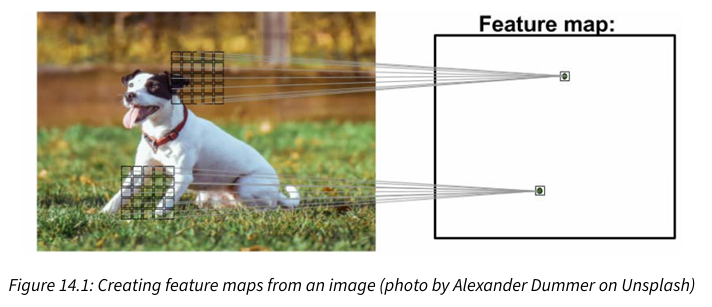
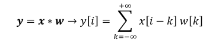
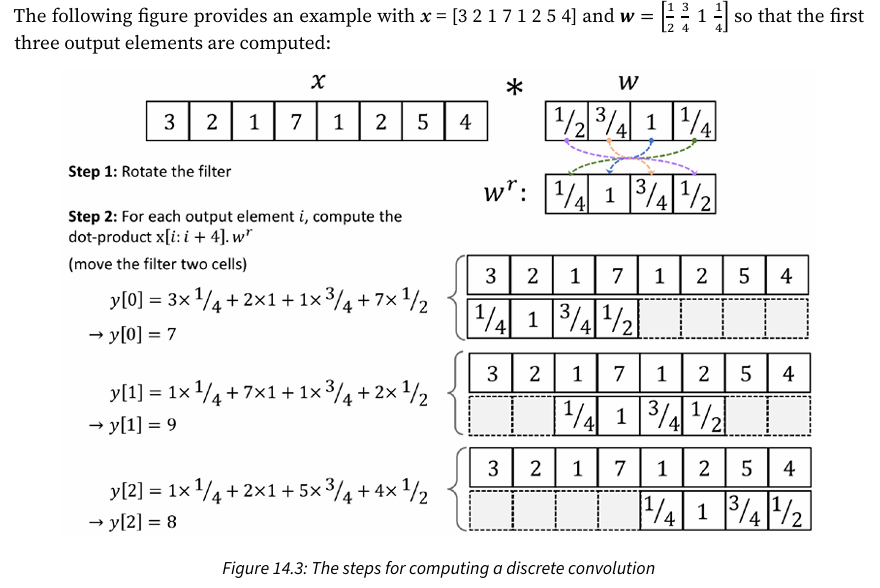
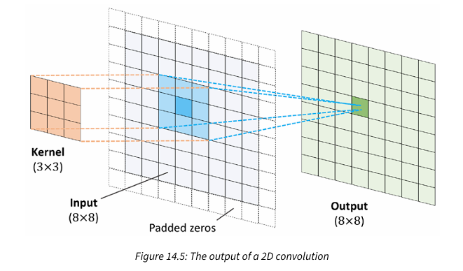
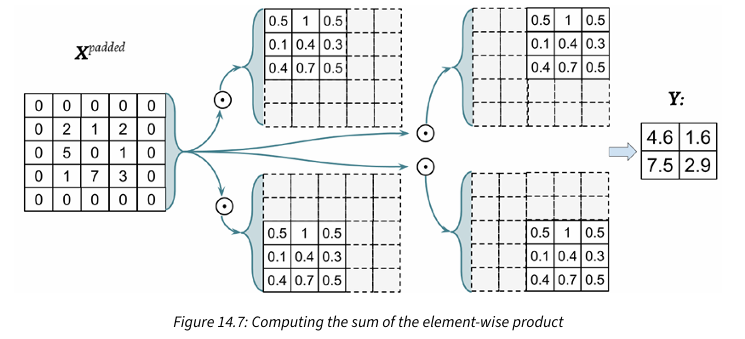
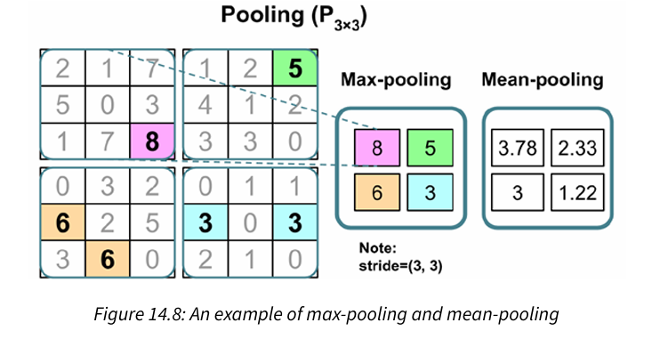
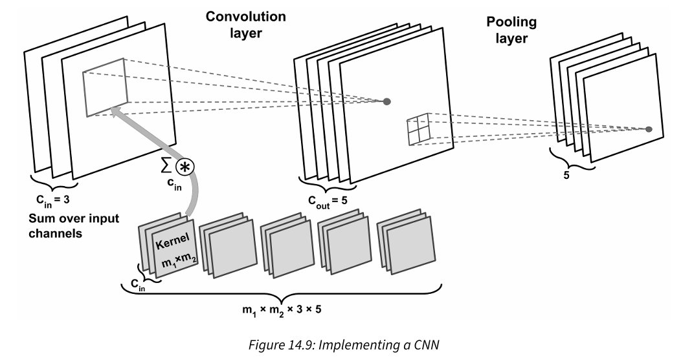

## Textbook Chapter 14 Notes - Deep Convolutional Neural Networks

- [Implementing a Deep CNN using PyTorch](#-implementing-a-deep-cnn-using-pytorch)

## Questions and Comments 
- I think it's interesting how they don't just zero pad the vectors but it makes sense

## The Building Blocks of CNNs
- CNNS are models that were originally inspired by how the visual cortex of the human brain works when recognizing objects
    - Development goes all the way back to the 1990s
    - Outstanding for image classification tasks
    - Convolutional architectures are often described as "feature extraction layers"

- Successfully extracting salient (relevant) features is key to performance of any machine learning algorithm
    - Traditional machine learning models rely on input features that may come from a domain expert
    - Or based on computational feature extraction techniques
- CNNs can automatically learn the features from raw data that are most useful for a particular task
    - Common to consider CNN layers as feature extractors
    - Early layers (right after input layer) extract low-level features from raw data
    - Layer layers (often fully connected layers as in a multilayer perceptron (MLP)) use these featurse to predict a continuous target value or class label
- Deep CNNs construct a "feature hierarchy" by combining the low-level features in a layer wise fashion to form high-level features
    - In images, low-level features are like edges or blobs and are captured by the earlier layers
    - These high-level features can form more complex shapes like general contours of objects like buildings, cats, or dogs


- Feature map = each element comes from a local patch of pixels in the input image
- Local patch of pixels = local receptive field
    - Sparse connectivity: a single element in the feature map is connected to only a small patch of pixels (different form connecting to the whole input image as in MLPs)
    - Parameter sharing: Same weights are used for different patches of the input image

- Thus using a convolution layer (instread of a fully connected MLP) significantly decreases the number of weights in the network
    - Improves the ability to capture *salient* features
    - It makes sense to assume that nearby pixels are typically more relevant to each other than pixels that are far away from each other

- Typicall CNNs are composed of several convolutional and subsampling layers followed by one or more fully connected layers at the end
    - The fully connected layers are essentially an MLP where every input i is connected to every output j with weight w(i,j)
    - subsampling layers = pooling layers
        - Do not have any learnable parameters
        - No weights or biases
    - Convolutional and fully connected layers have weights and biases that are optimized during training

Performing Discrete Convolutions
---
- Fundamental operation in a CNN
- A discrete convolution for two vectors x and w can be expressed as: y = w * x
    - x is input or signal
    - w is the filter or kernel


- Use the -inf and inf to represent all of the values
    - Assume that x and w are filled with zeros
- The output vector y is of finite size

- Computing the sum with one index going in the reverse direction = sum with both indices in the forward direction
    - Flip and slide!!! (They even kinda mention it "This operation is repeated like in a sliding window approach to get all the output elements")
    - Then can simply compute the dot product



- Rotated filter w' is getting shifted by two cells every shift
- Shift is a hyperparameter of a convolution called **stride**
    - Has to be a positive number < size of input vector

- So far, only used zero-padding to compute finite sized output vectors in convolutions
    - Padding can technically be applied with any number >= 0
    - Boundary cells may be treated differently than the cells located in the middle of x
        - As toward the center, there will be more computations involved than around the boundaries
- Three modes of padding that are commonly used in practice
    - Full: Padding parameter is set to p = m (window size) - 1 (increases dimensions of output, thus rarely used in CNNs)
    - Same: Used to ensure that the output vector has the same size as the input vector x. Padding parameter is computed according to filter size as well as requirement that input and output have the same size.
    - Valid: Padding where p = 0 (no padding)
- Most commonly used padding in CNNs is same padding
    - Same padding preserves the size of the vector (height and width of the input images)
    - Makes desigining a network architecture more convenient
- Valid padding disadvantage is that the volume of tensors will decrease substantially in NNs with many layers
    - Can be detrimental to the network's performance
    - Should preserve the spatial size using same padding for the convolutional layers 
    - Should decrease the spatial size via pooling layers or convolutional layers with stride 2
- Full padding size results in an output larger than the input
    - Usually used in signal processing where it's important to minimize boundary effects
    - In a deep learning approach, boundary effects are usually not an issue

- The output size of a convolution ~ number of times that the filter is shifted along the input vector
    - Input vector has size `n` and the filter is of size `n`. With padding `p` and stride `s`, the size of the output is: `o = floor((n + 2p - m) / s) + 1`

```python3
import numpy as np
def conv1d(x, w, p=0, s=1):
    w_rot = np.array(w[::-1])
    x_padded = np.array(x)
    if p > 0:
        zero_pad = np.zeros(shape=p)
        x_padded = np.concatenate([
            zero_pad, x_padded, zero_pad
        ])
    res = []
    for i in range(0, int((len(x_padded) - len(w_rot))) + 1, s):
        res.append(np.sum(x_padded[i:i+w_rot.shape[0]] * w_rot))
    return np.array(res)
```
- "naive" implementation to compute 1d convolutions

Discrete Convolutions in 2D
---
- Pretty much the exact same thing as in 1D but now a double sum lol
- Also now X and W are matrices
- All techniques like zero padding, rotating the filter matrix, and the use of strides are also applicable to 2d convolutions
    - Provided they are extended to both dimensions independently





```python3
import numpy as np
import scipy.signal

def conv2d(X, W, p=(0, 0), s=(1, 1)):
    W_rot = np.array(W)[::-1,::-1]
    X_orig = np.array(X)
    n1 = X_orig.shape[0] + 2*p[0]
    n2 = X_orig.shape[1] + 2*p[1]
    X_padded = np.zeros(shape=(n1, n2))
    X_padded[p[0]:p[0]+X_orig.shape[0], p[1]:p[1]+X_orig.shape[1]] = X_orig 

    res = []
    for i in range(0, int((X_padded.shape[0] - W_rot.shape[0])/s[0])+1, s[0]):
        res.append([])
        for j in range(0, int((X_padded.shape[1] - W_rot.shape[1])/s[1])+1, s[1]):
            X_sub = X_padded[i:i+W_rot.shape[0], j:j+W_rot.shape[1]]
            res[-1].append(np.sum(X_sub * W_rot))

    return(np.array(res))
```
- Again a "naive" implementation for the purpose of understanding
- There's more efficent implementations that use the FFT to compute convolutions
    - In the context of NNs, the size of a convolution kernel is much smaller than the size of the input image


Subsampling Layers
---
- Typically applied in two forms of pooling operations in CNNs: Max-pooling and mean-pooling
    - Typically denoted by P(n1 x n2) (subscripted)
    - Subscript determines the size of the neighborhood (number of adjacent pixels in each dimension) where the max or mean operation is performed
    - Refer to this neighborhood as the **pooling size**


- Max pooling = max value from neighborhood of pixels
- Mean pooling = average value in the whole neighborhood

Advantage of max pooling:
    - Introduces a local invariance; Small changes in a local neighborhood do not change the result of max pooling
    - Thus it helps with generating robust features immune to noise
    - Pooling decreases the size of features which results in higher computational efficiency
        - Might help reduce the degree of overfitting as well

- Some CNN architectures don't have pooling
    - Instead they use convolutional layers with a stride of 2
    - Can think of this as a pooling layer with learnable weights
- In a traditional NN, the most important operation is matrix multiplication
- In a CNN, the most important operation is the convolution `Z = W * X + b`
    - X is a matrix represent pixels in a *height x width* arrangement

Implementing a CNN
---
- Input to a convolutional layer may contain one or more 2D arrays or matrices with dimensions N1 x N2
    - Matrices are called channels
- Conventional implementaitons expect a rank-3 tensor representation as input (extra dimension is number of input channels)
    - Ex. if image is colored and used the RGB color mode, then the third dimension C(in) = 3 for each R, G, B
    - Ex. in grayscale, C(in) = 1

- When working with images, can read them into NumPy arrays using the uint8 datarype which takes values from [0, 255]
    - Sufficient to store the pixel information in RGB images
- To incorporate multiple input channels in the convolution, perform convolution for each channel seperately and the nadd results together using matrix summation


- There are three input channels (thus kernel tensor is 4D)
- Each matrix is m1 x m2 and there are three of them, one for each input channel
- There are five such kernels accountinf for five output feature maps
- There is a pooling layer for subsampling the feature maps
- Convolution operations typically carried out by treating an input image with multiple color channels as a stack of matrices
    - Perform convolution on each matrix seperately and then add results

- Capacity of network = level of complexity of the function that it can learn to approximate
    - Small networks (little parameters) = low capacity, likely to underfit
    - Large networks (lots of parameters) = overfit 
- Do not know how large the network should be a priori (in advance)
    - Build a network with a relatively large capacity (choose slightly larger than necessary) 
    - Then add regularization terms to achieve good generalization performance

```python3
import torch.nn as nn

loss_func = nn.BCELoss()
loss = loss_func(torch.tensor([0.9]), torch.tensor([1.0]))
l2_lambda = 0.001

conv_layer = nn.Conv2d(in_channels=3, out_channels=5, kernel_size=5)
l2_penalty = l2_lambda * sum([(p**2).sum() for p in conv_layer.parameters()])
loss_with_penalty = loss + l2_penalty

linear_layer = nn.Linear(10, 16)
l2_penalty = l2_lambda * sum([(p**2).sum() for p in linear_layer.parameters()])
loss_with_penalty = loss + l2_penalty
```

or can do 
```python3
optimizer = torch.optim.SGD(
    model.parameters()
    weight_decay=l2_lambda,
    ...
)
```
- Weight decay and L2 regularization are not identical but equivalent when usign SGD

- Can also use **dropout** to avoid overfitting
    - Usually applied to hidden units of higher layers 
    - During training phase of NN, fraction of hidden units are randomly dropped at every iteration with probability p(drop)
    - When dropping input neurons, weights associated with the remaining neurons are rescaled to account for the missing neurons
    - Thus, network is forced to learn a redundant representation of data & cannot rely on activation of any set of hidden units
    - Hidden units may be turned off ay any time during training thus have to learn more general and robust patterns of data
- Units may drop during training only, but all units must be active during inference
- Activations of the active neurons have to be sacaled appropriately to ensure overall activations are on same scale during training and prediction
    - Ex. halving activation if dropout probability was set to p = 0.5
    - PyTorch and other tools scale activations during training = inverse dropout

Loss Functions for Classificaiton
---
- ReLU commonly used in hidden layers to avoid non-linearities of model
- Sigmoid (binary) and softmax (multiclass) are added at output layer
    - Model will compute logits instead of class-membership probabilities instead if there weren't sigmoud or softmax

- Binary cross-entropy = loss function for binary class classification (single output unit)
    - Either provide logits as input to `nn.BCEWithLogitsLoss()`
    - Or compute probabilities based on logits and feed them to `nn.BCELoss()`
- Categorical cross-entropy = loss function for multiclass classification
    - In the `torch.nn` module, it takes in ground truth labels as integers
    - Either provide logits as inputs to `nn.CrossEntropyLoss`
    - Or compute log probabilities based on logits and feed them to `nn.NLLLoss()`
- Computing cross-entropy loss by providing logits, not class-membership probabilities is usually perferred due to numerical stability

```python3
###### Binary Cross-entropy
logits = torch.tensor([0.8])
probas = torch.sigmoid(logits)
target = torch.tensor([1.0])
bce_loss_fn = nn.BCELoss()
bce_logits_loss_fn = nn.BCEWithLogitsLoss()
print(f'BCE (w Probas): {bce_loss_fn(probas, target):.4f}')

==> BCE (w Probas): 0.3711

print(f'BCE (w Logits): 'f'{bce_logits_loss_fn(logits, target):.4f}')

==> BCE (w Logits): 0.3711
###### Categorical Cross-entropy
logits = torch.tensor([[1.5, 0.8, 2.1]])
probas = torch.softmax(logits, dim=1)
target = torch.tensor([2])
cce_loss_fn = nn.NLLLoss()
cce_logits_loss_fn = nn.CrossEntropyLoss()
print(f'CCE (w Probas): 'f'{cce_logits_loss_fn(logits, target):.4f}')

==> CCE (w Probas): 0.5996
print(f'CCE (w Logits): 'f'{cce_loss_fn(torch.log(probas), target):.4f}')

==> CCE (w Logits): 0.5996
```

## Implementing a Deep CNN using PyTorch
Going to do this using the MNIST (handwritten digits) dataset

- `Input: [batch_size x 28 x 28 x 1]`
- `Conv_1: [batch_size x 28 x 28 x 32]`
- `Pool_1: [batch_size x 14 x 14 x 32]`
- `Conv_2: [batch_size x 14 x 14 x 64]`
- `Pool_2: [batch_size x 7 x 7 x 64]`
- `FC_1: [batch_size x 1024]`
- `FC_2 & softmax: [batch_size x 10]`
    - FC = fully connected layer
    - Second fully connected layer is softmax output layer

```python3
import torchvision
from torchvision import transforms
from torch.utils.data import Subset

image_path = './'
transform = transforms.Compose([transforms.ToTensor()])

mnist_dataset = torchvision.datasets.MNIST(root=image_path, train=True, transform=transform, download=True)
mnist_valid_dataset = Subset(mnist_dataset, torch.arange(10000))
mnist_train_dataset = Subset(mnist_dataset, torch.arange(10000, len(mnist_dataset)))
mnist_test_dataset = torchvision.datasets.MNIST(root=image_path, train=False, transform=transform, download=False)
```

Construct data loader with batches of 64 images for training and validation set
```python3
from torch.utils.data import DataLoader
batch_size = 64
torch.manual_seed(1)
train_dl = DataLoader(mnist_train_dataset, batch_size, shuffle=True)
valid_dl = DataLoader(mnist_valid_dataset, batch_size, shuffle=False)
```

Implementing CNN using `torch.nn` module
```python3
model = nn.Sequential()
model.add_module('conv1', nn.Conv2d(in_channels=1, out_channels=32,kernel_size=5, padding=2))
model.add_module('relu1', nn.ReLU())
model.add_module('pool1', nn.MaxPool2d(kernel_size=2))
model.add_module('conv2', nn.Conv2d(in_channels=32, out_channels=64, kernel_size=5, padding=2))
model.add_module('relu2', nn.ReLU())
model.add_module('pool2', nn.MaxPool2d(kernel_size=2))

model.add_module('flatten', nn.Flatten())

model.add_module('fc1', nn.Linear(3136, 1024))
model.add_module('relu3', nn.ReLU())
model.add_module('dropout', nn.Dropout(p=0.5))
model.add_module('fc2', nn.Linear(1024, 10))
```
- Use `nn.Sequential` to stack layers
- When reading an image, the default dimension for the channels is the first dimension of the tensor array
    - Called NCHW format
    - N = num images
    - C = channels
    - H & W = height & width
- `Conv2D` assumes inputs are NCHW by default
- Using same padding mode in convolutional layers preserves the spatial dimensions of the feature maps s.t. the inputs and outputs have the same height and width
- Need to flatten output of previous layers s.t. shape of input to fully connected layer is `[batch_size x input_units]`

```python3
loss_fn = nn.CrossEntropyLoss()
optimizer = torch.optim.Adam(model.parameters(), lr=0.001)
```
- May as well just use `nn.CrossEntropyLoss()` as it already has softmax built into it

Next train the modelw
```python3
def train(model, num_epochs, train_dl, valid_dl):
    loss_hist_train = [0] * num_epochs
    accuracy_hist_train = [0] * num_epochs
    loss_hist_valid = [0] * num_epochs
    accuracy_hist_valid = [0] * num_epochs
    
    for epoch in range(num_epochs):
        model.train()
        for x_batch, y_batch in train_dl:
            pred = model(x_batch)
            loss = loss_fn(pred, y_batch)
            loss.backward()
            optimizer.step()
            optimizer.zero_grad()
            loss_hist_train[epoch] += loss.item()*y_batch.size(0)
            
            is_correct = (torch.argmax(pred, dim=1) == y_batch).float()
            accuracy_hist_train[epoch] += is_correct.sum()
        
        loss_hist_train[epoch] /= len(train_dl.dataset)
        accuracy_hist_train[epoch] /= len(train_dl.dataset)

        model.eval()
    with torch.no_grad():
        for x_batch, y_batch in valid_dl:
            pred = model(x_batch)
            loss = loss_fn(pred, y_batch)
            loss_hist_valid[epoch] += loss.item()*y_batch.size(0)
            
            is_correct = (torch.argmax(pred, dim=1) == y_batch).float()
    accuracy_hist_valid[epoch] += is_correct.sum()
    loss_hist_valid[epoch] /= len(valid_dl.dataset)
    accuracy_hist_valid[epoch] /= len(valid_dl.dataset)

    print(f'Epoch {epoch+1} accuracy: 'f'{accuracy_hist_train[epoch]:.4f} val_accuracy: 'f'{accuracy_hist_valid[epoch]:.4f}')
    
    return loss_hist_train, loss_hist_valid, accuracy_hist_train, accuracy_hist_valid
```
- Using designated settings for training `model.train()` and evaluation `model.eval()` will automatically set mode for dropout later and rescale the hidden units appropriately


```python3
import matplotlib.pyplot as plt

torch.manual_seed(1)
num_epochs = 20
hist = train(model, num_epochs, train_dl, valid_dl)

x_arr = np.arange(len(hist[0])) + 1
fig = plt.figure(figsize=(12, 4))
ax = fig.add_subplot(1, 2, 1)
ax.plot(x_arr, hist[0], '-o', label='Train loss')
ax.plot(x_arr, hist[1], '--<', label='Validation loss')

ax.legend(fontsize=15)
ax = fig.add_subplot(1, 2, 2)
ax.plot(x_arr, hist[2], '-o', label='Train acc.')
ax.plot(x_arr, hist[3], '--<', label='Validation acc.')
ax.legend(fontsize=15)
ax.set_xlabel('Epoch', size=15)
ax.set_ylabel('Accuracy', size=15)
plt.show()
```

Evaluate on test dataset
```python3
pred = model(mnist_test_dataset.data.unsqueeze(1) / 255.)
is_correct = (torch.argmax(pred, dim=1) == mnist_test_dataset.targets).float()
print(f'Test accuracy: {is_correct.mean():.4f}')
```
- Results in 99% accuracty

The other example is using the celebrity smiling dataset
- More or less the same
- Has code with changing the image using `transforms` library (flip, crop, adjust brightness & contrast, resize, etc.)

